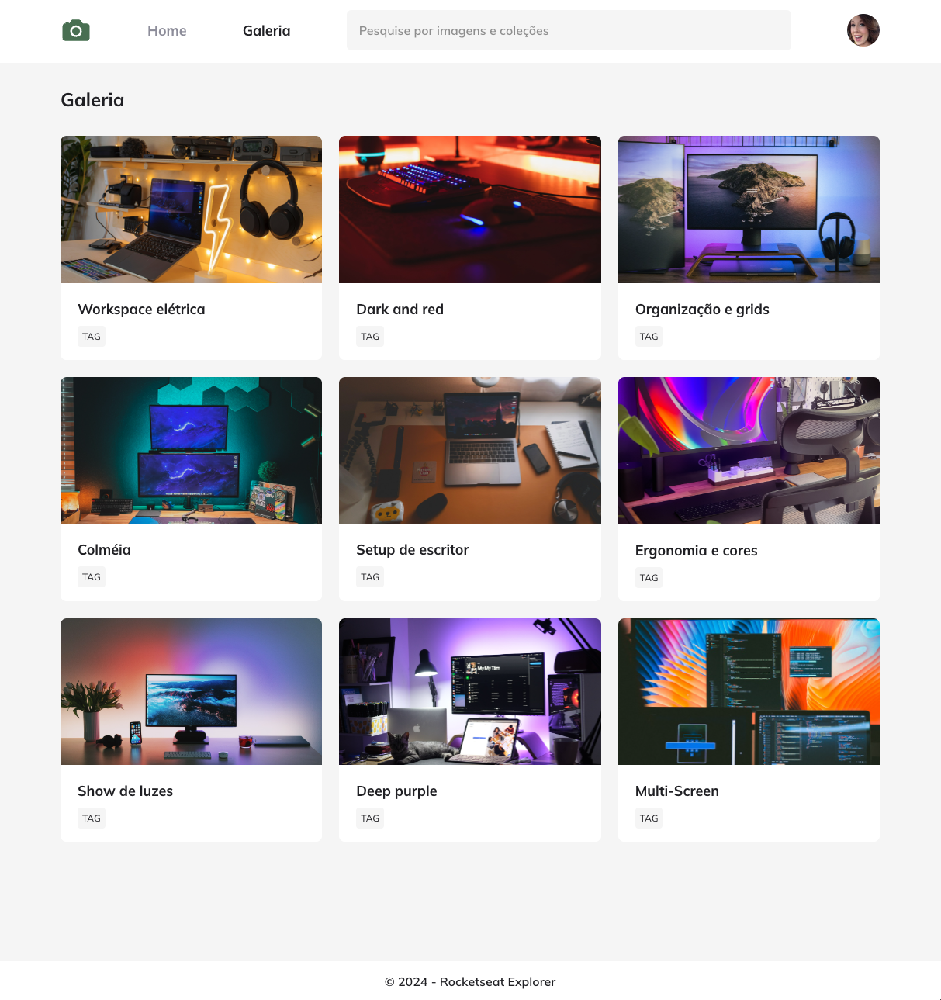

# 📸 Fotoblog • Projeto Explorer (Community)
🇺🇸 _Photoblog • Explorer Project (Community)_

## 👩🏻‍💻 Sobre este site

🇧🇷 Este projeto de Fotoblog, nos permite atuar mais com responsividade, grid e animações. 

## 👩🏻‍💻 _About this website_ 
🇺🇸 _This Photoblog project allows us to work more with responsiveness, grid and animations._

# 📸 Screenshot 

# 🚀 Techologies
🇧🇷 Esse projeto foi desenvolvido com as seguintes tecnologias: 

🇺🇸 This project was developed with the following technologies: 

- [HTML](../index.html)
- [CSS](../style.css)
- [Git e Github](https://github.com/)
- [Figma](www.figma.com)
- [Rocketseat](www.rocketseat.com.br)

##

- 🔗 **[Online project](../index.html)**

##
🗓️ Jan. 2024

## 
                      ・Developed with ♡ by BM